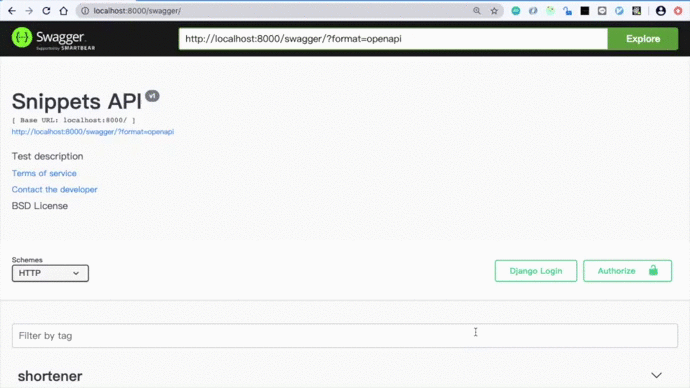

# URL-Shortening-Demo
This respository is a URL shortening demo website.

## Backend

### Run Server With Docker
- `docker build -t shortener .`
- `docker run -p 8000:8000 shortener`
- Visit [http://localhost:8000/swagger/](http://localhost:8000/swagger/)

### Run Server With Python
- Create virtual environment: `python3 -v venv venv`
- Activate virtual environment:
    - Mac: `. venv/bin/activate`
- Install requirements: `pip install -r requirements.txt`
- Migrate Database: `python manage.py migrate`
- Start project: `python3 manage.py runserver`
- Visit [http://localhost:8000/swagger/](http://localhost:8000/swagger/)

### How to use
- You can create a short URL by POST [/shortener/](http://localhost:8000/shortener/).
- After getting the short URL, you can request it and get the website.

## Test
- Run test scripts: `python manage.py test`
- CI: travis

## Results

Results       | Code  | Message         | Error Detail
--------------|:-----:|----------------:| -----------:
Success       | 0000  |  Success        |  None       
Database Error| 1000  |  Database Error |  \<String\>   
Request Error | 2000  |  Request Error  |  \<String\>   
